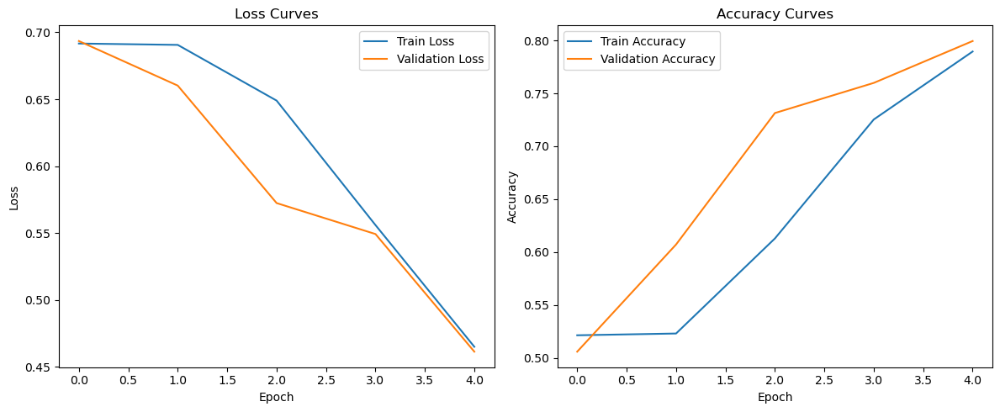

# PyTorch Sentiment Analysis on IMDB Dataset

This project implements a **Sentiment Analysis model using PyTorch and LSTM** on the IMDB movie reviews dataset.

The model classifies movie reviews as **Positive or Negative** using deep learning techniques for Natural Language Processing (NLP).

---

## Project Overview

This project demonstrates a complete NLP pipeline including:

* Text preprocessing and cleaning
* Tokenization and vocabulary construction
* Sequence encoding and padding
* LSTM-based deep learning model
* Model training and validation
* Model evaluation and prediction

---

## Dataset

Dataset used: **IMDB Movie Reviews Dataset**

The dataset contains thousands of movie reviews labeled as:

* Positive sentiment
* Negative sentiment

The goal of the model is to correctly classify the sentiment of each review.

---

## Model Architecture

The deep learning architecture includes:

* Embedding Layer
* LSTM Layer
* Dropout Regularization
* Fully Connected Output Layer

The model is trained for **binary sentiment classification**.

---

## Training Results

Below are the training curves for **loss and accuracy** during training:



---

## Technologies Used

* Python
* PyTorch
* Pandas
* NumPy
* Scikit-learn
* Matplotlib
* Jupyter Notebook

---

## How to Run the Project

Install the required libraries:

```
pip install -r requirements.txt
```

Then run the notebook:

```
jupyter notebook
```

Open the notebook:

```
Sentiment Analysis with PyTorch.ipynb
```

and execute the cells sequentially.

---

## Output

The model predicts whether a movie review expresses **positive or negative sentiment**.

Example:

```
"This movie was absolutely fantastic!"
Prediction: Positive
```

---

## Author

AI / Machine Learning enthusiast focused on NLP and Deep Learning applications.
